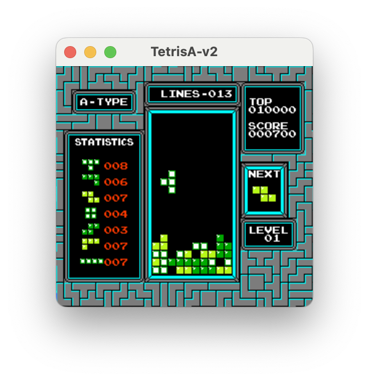

# NES Tetris AI 

<div align="center">
  
</div>

This project implements an AI agent that plays NES Tetris using computer vision and evolutionary algorithms. The agent recognizes the Tetris field from the NES screen, parses the game state, and evolves strategies to maximize its score.

## Features

- **Field Extraction:** Uses OpenCV to detect and extract the Tetris playfield from NES screen images.
- **Game State Parsing:** Converts the extracted field into a grid representation for AI decision-making.
- **Evolutionary Algorithm:** Optimizes agent strategies over generations using genetic operations.
- **Automated Gameplay:** Interacts with the `gym_tetris` environment to play NES Tetris.
- **Debug Visualization:** Optionally displays intermediate image processing steps for debugging.

## Requirements

Install dependencies:
```bash
pip install -r requirements.txt
```

## Usage

Run the AI agent:
```bash
python main.py
```

Optional arguments:
- `-r`, `--render`: Render the game window.
- `-v`, `--verbose`: Print verbose logs to the console.


## How It Works

1. **Field Extraction:** The agent uses computer vision to locate and crop the Tetris playfield from the NES screen.
2. **Parsing:** The playfield is converted into a 20x10 grid representing block occupancy.
3. **Decision Making:** The agent selects moves based on the current piece and field state.
4. **Evolution:** After each generation, the best-performing genomes are selected and mutated to create the next generation.

